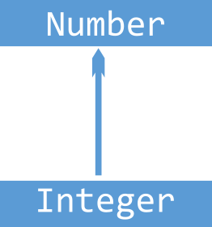
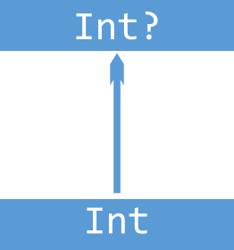
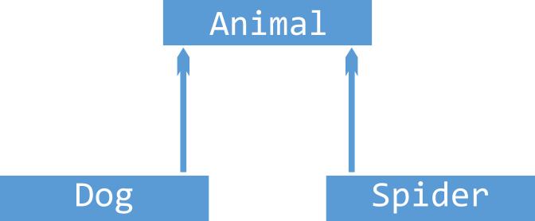
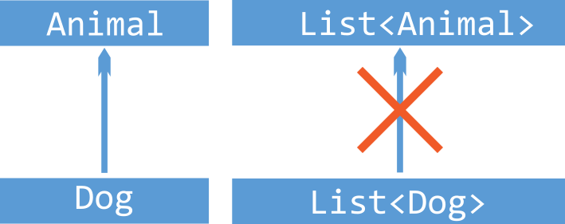
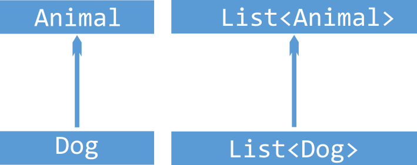
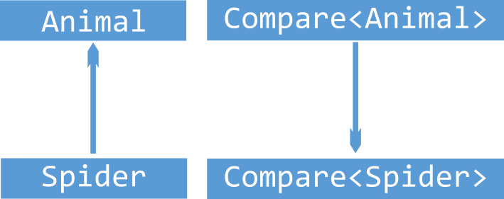

# Programación - 06 Tipos Genéricos, Abstractos y Colecciones

Tema 06 Tipos Genéricos, Abstractos y Colecciones. 1DAM. Curso 2022/2023.


- [Programación - 06 Tipos Genéricos, Abstractos y Colecciones](#programación---06-tipos-genéricos-abstractos-y-colecciones)
  - [Contenidos](#contenidos)
  - [Tipos Genéricos](#tipos-genéricos)
    - [Tipos y subtipos](#tipos-y-subtipos)
    - [Varianza](#varianza)
    - [Invarianza](#invarianza)
    - [Covarianza](#covarianza)
    - [Contravarianza](#contravarianza)
    - [Proyectividad](#proyectividad)
    - [Acotaciones](#acotaciones)
  - [Tipos de Datos Abstractos](#tipos-de-datos-abstractos)
    - [Pair y Triple](#pair-y-triple)
  - [Colecciones](#colecciones)
  - [Listas, Pilas y Colas](#listas-pilas-y-colas)
    - [Listas](#listas)
    - [Pilas](#pilas)
    - [Colas](#colas)
  - [Otros ejemplos](#otros-ejemplos)
  - [Recursos](#recursos)
  - [Recursos](#recursos-1)
  - [Autor](#autor)
    - [Contacto](#contacto)
    - [¿Un café?](#un-café)
  - [Licencia de uso](#licencia-de-uso)


## Contenidos
1. Tipos Genéricos
2. Tipos de Datos Abstractos
3. Introducción a las Colecciones
4. Listas, Pilas y Colas
5. Conjuntos y Comparadores
6. Mapas
7. Operaciones con Colecciones: Filtrado, Mapeado, Agrupado, Ordenado, etc.

## Tipos Genéricos
Los tipos genéricos son una forma de reutilizar código, permitiendo que los tipos de datos sean variables. Esto nos permite crear clases, interfaces y métodos que pueden operar con objetos de diferentes tipos, siempre y cuando estos objetos sean compatibles con los parámetros de tipo.

En Kotlin los tipos genéricos se definen con la palabra clave **`<T>`**. Aunque el identificador del tipo genérico puede ser cualquier letra o palabra.

Por ejemplo, si queremos crear una clase que represente una caja de cualquier tipo, podemos hacerlo de la siguiente manera:

```kotlin
class Caja<T>(t: T) {
    var valor = t

    fun obtener(): T {
        return valor
    }

    fun mostrar() {
        println(valor.toString())
    }
}

fun main() {
    val cajaEntero = Caja(10)
    val cajaCadena = Caja("Hola")
    val cajaBooleano = Caja(true)

    cajaEntero.mostrar()
    cajaCadena.mostrar()
    cajaBooleano.mostrar()
}
```

### Tipos y subtipos
Un subitipo es un tipo que hereda de otro tipo. Por ejemplo, Profesor hereda de Persona, por lo que podemos asignar un objeto de tipo Profesor a una variable de tipo Persona. Esto se conoce como subtipado. Pero al contrario no es posible. Esto además debería casar con el principio de sustitución de Liskov y aplicando otros elementos como herencia y polimorfismo.

```kotlin
open class Persona(val nombre: String)
class Profesor(nombre: String, val materia: String) : Persona(nombre)

fun main() {
    val persona: Persona = Profesor("Pepe", "Matemáticas")
    println(persona.nombre)
}
```

### Varianza
La varianza es una propiedad que tienen los tipos genéricos que nos permite definir si un tipo genérico es invariante, covariante o contravariante. Es decir, si un tipo genérico puede ser sustituido por otro tipo genérico de la misma familia. Lamentablemente no se cumple el pricipio visto en el ejemplo anterior.

Veamos este ejemplo

  

```kotlin
val integer: Int = 1
val number: Number = integer // Esto es posible porque Int es subtipo de Number
val integer: Int = 1;
val nullableInteger: Int? = integer; // Esto es posible porque Int? es subtipo de Int
```

```kotlin
abstract class Animal(val size: Int)
class Dog(val cuteness: Int): Animal(100)
class Spider(val terrorFactor: Int): Animal(1)

fun main() {
    val dog: Dog = Dog(10)
    val spider: Spider = Spider(9000)
    val animal: Animal = dog // Esto es posible porque Dog es subtipo de Animal
    animal = spider // Esto es posible porque Spider es subtipo de Animal
}
```

Lamentablemente cuando estamos con genéricos esto no siempre es posible. Veamos un ejemplo

```kotlin
integerList = mutableListOf(1, 2, 3) 
numberList: MutableList<Number> = integerList; // esto no es posible porque List<Int> no es subtipo de List<Number>
```

Debemos tener en cuenta que los tipos genéricos son invariantes por defecto. Esto es debido a que se puede producir y consumir tipos y que estas colecciones sun mutables. 
Esto quiere decir que no podemos asignar un tipo genérico a otro tipo genérico de la misma familia superior. Para poder hacerlo debemos indicar que el tipo genérico es covariante o contravariante. Para ello debemos indicar la palabra clave **`out`** o **`in`** respectivamente.

***IMPORTANTE***: 
- Colecciones Mutables es invariante con respecto a su tipo genérico. (no podemos ni consumir ni producir/añadir valores con un tipo más genérico)
- Colecciones Inmutables es covariante con respecto a su tipo genérico (podemos consumir sus valores con un tipo más genérico)

¿Qué significa consumir (covarianza) y qué producir (contravarianza)?
- Consumir implica tener funciones que devuelven un valor del tipo genérico
- Producir implica tener funciones que reciben por argumento un objeto del tipo genérico

### Invarianza
La invarianza nos indica que un tipo no puede ser usado en un contexto donde se espera otro tipo. Es la usada por defecto en colecciones mutables tal y como hemos visto.




```kotlin
val integerList: MutableList<Int> = mutableListOf(1, 2, 3)
val numberList: MutableList<Number> = integerList // Esto no es posible porque MutableList<Int> no es subtipo de MutableList<Number>

al dogList: MutableList<Dog> = mutableListOf(Dog(10), Dog(20), Dog(30))
val animalList: MutableList<Animal> = dogList // Esto no es posible porque MutableList<Dog> no es subtipo de MutableList<Animal>
```
    
```kotlin
// Invariante: No sabemos si vamos a consumir o producir, por lo que no podemos usarlo en un contexto donde se espera otro tipo
class EncrypterInvariante<T>(val item: T) {
    fun encrypt(): T {
        return item
    }

    fun decrypt(item: T) {
        println(item.toString())
    }
}

val e: EncrypterInvariante<Int> = EncrypterInvariante(10)
val e2: EncrypterInvariante<Number> = e // Por defecto es invariante, no es posible

```

### Covarianza
La covarianza es la es la capacidad de un tipo de ser usado en un contexto donde se espera un tipo más general. Aparece directamente si las colecciones son inmutables. Además, si queremos detallarlo en otras debemos indicar la palabra clave **`out`**. Por ejemplo, si queremos que una lista de perros pueda ser usada como una lista de animales. Para ello el tipo genérico solo debe aparecer como elemento de salida de una función o como tipo de retorno de una función.



```kotlin
val dogList: List<Dog> = listOf(Dog(10), Dog(20))
val animalList: List<Animal> = dogList // Esto es posible porque List<Dog> es subtipo de List<Animal> Inmutable
```

Otro ejemplo usando out para especificarlo con colecciones mutables o si sabemos con seguridad que no vamos a producir valores, solo consumirlos.

```kotlin
// Covariante: Nosotros aseguramos que solo vamos a consumir con el generico
//  usamos out, es decir, solo vamos a consumir, no producir
// el generico esta en la devolución de las funciones
class EncrypterCovariante<out T>(val item: T) {
    fun metodo(): T {
        return item
    }
}

// si sabemos que solo vamos a consumir, podemos permitirlo
// el generico solo esta en los devolución de las funciones
// EncrypterCovariante<Number> <- EncrypterCovariante<Int>  OK // Covariante, porque solo consumimos
val e3: EncrypterCovariante<Int> = EncrypterCovariante(10)
val e4: EncrypterCovariante<Number> = e3

```

### Contravarianza
La contravarianza es la capacidad de un tipo de ser usado en un contexto donde se espera un tipo más específico. Además, si queremos detallarlo debemos indicar la palabra clave **`in`**. Por ejemplo, si queremos que una lista de animales pueda ser usada como una lista de perros. Para ello el tipo genérico solo debe aparecer como elemento de entrada de una función o como tipo de argumento de una función.



```kotlin
val dogCompare: Compare<Dog> = object: Compare<Dog> {
  override fun compare(first: Dog, second: Dog): Int {
    return first.cuteness - second.cuteness
  }
}

val animalCompare: Compare<Animal> = dogCompare // Esto no es posible porque Compare<Dog> no es subtipo de Compare<Animal>!!!

val animalCompare: Compare<Animal> = object: Compare<Animal> {
  override fun compare(first: Animal, second: Animal): Int {
    return first.size - second.size
  }
}
val spiderCompare: Compare<Spider> = animalCompare // Esto es posible porque Compare<Animal> es subtipo de Compare<Spider> Contravariante!!
```
```kotlin
// Contravariante: Nosotros aseguramos que solo vamos a producir con el generico
// usamos int, es decir, solo vamos a producir (usarlo como parametro), no consumir (devolver)
// el genérico esta en los parámetros de las funciones
class EncrypterContravariante<in T>() {
    fun metodo(item: T): String {
        return "Hola"
    }
}

// si sabemos que solo vamos a producir, podemos permitirlo
// Es decir el genérico solo esta en las parametros de las funciones
// EncrypterContravariante<Int> <- EncrypterContravariante<Out>  OK // Contravariante, porque solo producimos
val e5: EncrypterContravariante<Number> = EncrypterContravariante()
val e6: EncrypterContravariante<Int> = e5
```

```kotlin
interface ComparableInvariante<T> {
    fun compare(other: T): Int
}

// Esto va a dar error, ya que no hemos definido el tipo de varianza, y por tanto el tipo aquí es invariante: si no indicamos la varianza,
// no podemos convertir un Comparable<Number> en un Comparable<Float>.
fun testInvariante(comparable: ComparableInvariante<Number>) {
    val comp: ComparableInvariante<Float> = comparable // Error 
}

interface ComparableContravariante<in T> {
    fun compare(other: T): Int
}


// Tiene sentido que puedas hacerlo, ya que si el Comparable permite comparar Numbers,
// comparar con Floats es un subconjunto de lo que este tipo te deja hacer.
fun testCotravariante(comparable: ComparableContravariante<Number>) {
    val comp: ComparableContravariante<Float> = comparable
}
```

### Proyectividad
La proyección de un tipo genérico es el tipo de los objetos que se pueden obtener de él. Uso array porque se puede consumir y producir(get y set) y queremos especificar el manejo de la varianza

```kotlin

// Copiar Array of Subtipos a un Array of Supertipos
// Array<out T> es un Array de T de solo lectura
// Out, cualquier cosa por encima de Any, es lo cumple Any?


fun copy1(from: Array<out Any>, to: Array<Any?>) {
    for (i in from.indices)
        to[i] = from[i]
}

// Añadir elementos de un subtipo a un Array de supertipo
// Array<in T> es un Array de T donde vamos a producir
// con in decimos que como máximo un Int
fun fill(dest: Array<in Int>, value: Int) {
    dest[0] = value
}

/*
Hay situaciones en las que no nos importa el tipo específico de valor.
Digamos que solo queremos imprimir todos los elementos de un Array y no importa cuál
sea el tipo de elementos en este Array.
 */

fun printArray(array: Array<*>) {
    array.forEach { println(it) }
}

fun main() {
    val ints = arrayOf(1, 2, 3)
    val any = arrayOfNulls<Any>(3)
    copy1(ints, any)
    println(any.contentToString())

    val objects: Array<Any?> = arrayOfNulls(1)
    fill(objects, 1)

    val array = arrayOf(1, 2, 3)
    printArray(array)
}
```

### Acotaciones
Podemos acotar los tipos de datos que se pueden usar en un tipo genérico. Esto se hace mediante la palabra reservada **where** o usando **:**.

```kotlin
// Se traga cualquier cosa
fun <T> imprimir(valor: T) {
    println(valor)
}

// si no queremos nulos en el generico
fun <T : Any> imprimirNoNulo(valor: T) {
    println(valor)
}

// Esto es lo que se conoce como acotacion y extensión del tipo genérico


interface IAnimal
interface IDog {
    fun ladrar()
}

sealed class Animal(val nombre: String) : IAnimal
class Dog(nombre: String, edad: Int) : Animal(nombre), IDog {
    override fun ladrar() {
        println("Guau")
    }
}

class Cat(nombre: String, color: String) : Animal(nombre)

class CanicheRabioso(nombre: String, edad: Int) : IDog {
    override fun ladrar() {
        println("Guau")
    }
}

// Se puede acotar el tipo genérico a una clase o interfaz
// Solo son válidos los tipos que implementen la interfaz o hereden de la clase

// T debe ser un Animal
fun <T : Animal> imprimirCosa(animal: T) {
    println(animal)
}

// T debe implementar la interfaz IAnimal
fun <T : IAnimal> imprimirICosa(animal: T) {
    println(animal)
}

// T debe implementar la interfaz IDog
fun <T : IDog> imprimirIDog(animal: T) {
    println(animal)
}

// T debe ser un Animal y además implementar la interfaz IDog
fun <T> imprimirAnimal(animal: T) where T : Animal, T : IDog {
    println(animal)
}

```

## Tipos de Datos Abstractos
Los tipos de datos abstractos (TDA) son una forma de definir tipos de datos que se pueden usar en un programa. Un TDA es una estructura de datos que se define mediante un conjunto de operaciones que se pueden realizar sobre ella. Los TDA son una forma de encapsular datos y operaciones sobre ellos. Los TDA son una forma de encapsular datos y operaciones sobre ellos.

```kotlin
// Definición de un TDA
class TDA {
    // Atributos
    var atributo1: Int = 0
    var atributo2: String = ""
    // Métodos
    fun metodo1() {
        // Código
    }
    fun metodo2() {
        // Código
    }
}
```

### Pair y Triple
Kotlin nos proporciona dos clases para poder trabajar con pares y triples de datos. Estas clases son Pair y Triple. Estas clases son inmutables. Son muy útiles para devolver varios valores de una función. En el fondo son data classes que trabajan con pares y triples de datos genéricos.

```kotlin
// Pair
val pair = Pair(1, "Hola")
println(pair.first) // 1
println(pair.second) // Hola

// Triple
val triple = Triple(1, "Hola", 3.14)
println(triple.first) // 1
println(triple.second) // Hola
println(triple.third) // 3.14
```

## Colecciones
Las colecciones son TDAs que nos permiten poder manipular datos.

En Kotlin tenemos 3 tipos de colecciones:
- Listas: Colecciones de datos ordenadas y con acceso aleatorio.
- Conjuntos: Colecciones sin elementos repetidos.
- Mapas: Colecciones de pares clave-valor.

Además de estas colecciones tenemos las colecciones inmutables y mutables.
- Inmutables: No se pueden modificar una vez creadas.
- Mutables: Se pueden modificar una vez creadas.


## Listas, Pilas y Colas
### Listas
La lista es una colección de datos ordenados y con acceso aleatorio y en base a un índice usando el operador **[]**. Las listas son inmutables por defecto. Para poder crear una lista mutable debemos usar la función mutableListof().

```kotlin
// Lista inmutable
val lista = listOf(1, 2, 3, 4, 5)
println(lista[0]) // 1
println(lista[1]) // 2
println(lista[2]) // 3

// Lista mutable
val listaMutable = mutableListOf(1, 2, 3, 4, 5)
listaMutable[0] = 10
println(listaMutable[0]) // 10

// Lista de objetos
val listaObjetos = listOf(
    Dog("Firulais", 3),
    Dog("Rex", 5),
    Dog("Lassie", 7)
)

// Acceso a los elementos
println(listaObjetos[0].nombre) // Firulais
println(listaObjetos[1].nombre) // Rex
println(listaObjetos[2].nombre) // Lassie

// Listas de objetos con tipos genéricos
val listaObjetosGenericos = listOf<Dog>(
    Dog("Firulais", 3),
    Dog("Rex", 5),
    Dog("Lassie", 7)
)

// O fijando el tipo de dato
val listaObjetosGenericos2: MutableList<Dog> = mutableListOf(
    Dog("Firulais", 3),
    Dog("Rex", 5),
    Dog("Lassie", 7)
)

// Podemos inicializar una lista vacía
val listaVacia = mutableListOf<Dog>() // es mutable
// o de esta manera 
val listaVacia = emptyList<Dog>() // es inmutable
```

### Pilas
La pila es una colección de datos ordenados y con acceso LIFO (Last In First Out). Es decir, el último elemento que se introduce es el primero que se saca. Las operaciones que podemos realizar con una pila a nivel teórico son:
- push(): Añade un elemento a la pila.
- pop(): Saca un elemento de la pila.
- peek(): Devuelve el elemento que está en la cima de la pila sin sacarlo.

Podemos implementar una pila con una lista mutable o con ArrayDeque. ArrayDeque es una clase que implementa la interfaz Deque que es una interfaz que implementan las clases que implementan colas y pilas.
```kotlin
// Implementación con lista mutable
val pila = mutableListOf(1, 2, 3, 4, 5)
pila.add(6) // push
pila.removeAt(pila.size - 1) // pop
pila.removeLast() // pop (más eficiente)
println(pila.last()) // peek
println(pila) // [1, 2, 3, 4]

// Implementación con ArrayDeque
val stack = ArrayDeque<Int>()
stack.addLast(1) // push
stack.addLast(2) // push
stack.addLast(3) // push
stack.removeLast() // pop
println(stack.last()) // peek
println(stack) // [2, 1]
```

### Colas
Las colas son una colección de datos ordenados y con acceso FIFO (First In First Out). Es decir, el primer elemento que se introduce es el primero que se saca. Las operaciones que podemos realizar con una cola a nivel teórico son:
- enqueue(): Añade un elemento a la cola.
- dequeue(): Saca un elemento de la cola.
- first(): Devuelve el primer elemento de la cola sin sacarlo.

En Kotlin podemos implementar una cola con una lista mutable o con ArrayDeque. ArrayDeque es una clase que implementa la interfaz Deque que es una interfaz que implementan las clases que implementan colas y pilas.
```kotlin
// Implementación con lista mutable
val cola = mutableListOf(1, 2, 3, 4, 5)
cola.add(6) // encola  al final
cola.removeAt(0) // desencola al principio
cola.removeFirst() // desencola al principio (más eficiente)
println(cola.first()) // muestra el primer elemento
println(cola) // [3, 4, 5, 6]

// Implementación con ArrayDeque
val deque = ArrayDeque<Int>()
deque.addLast(1)
deque.addLast(2)
deque.addLast(3)
println(deque) // [1, 2, 3]
deque.removeFirst()
deque.removeFirst()
println(deque) // [3]
```


## Otros ejemplos
Parte de los ejemplos dell temario y ejemplo de este tema lo tienes disponible en este repositorio: [GitHub TDA-DAM](https://github.com/joseluisgs/TDA-DAM-2021-2022)

## Recursos
- Twitter: https://twitter.com/joseluisgonsan
- GitHub: https://github.com/joseluisgs
- Web: https://joseluisgs.github.io
- Discord: https://discord.gg/uv7GcytM
- Aula Virtual: https://aulavirtual33.educa.madrid.org/ies.luisvives.leganes/course/view.php?id=245


## Recursos
- Twitter: https://twitter.com/joseluisgonsan
- GitHub: https://github.com/joseluisgs
- Web: https://joseluisgs.github.io
- Discord del módulo: https://discord.gg/RRGsXfFDya
- Aula DAMnificad@s: https://discord.gg/XT8G5rRySU


## Autor

Codificado con :sparkling_heart: por [José Luis González Sánchez](https://twitter.com/joseluisgonsan)

[](https://twitter.com/joseluisgonsan)
[](https://github.com/joseluisgs)

### Contacto
<p>
  Cualquier cosa que necesites házmelo saber por si puedo ayudarte 💬.
</p>
<p>
 <a href="https://joseluisgs.github.io/" target="_blank">
        
    </a>  &nbsp;&nbsp;
    <a href="https://github.com/joseluisgs" target="_blank">
        
    </a> &nbsp;&nbsp;
        <a href="https://twitter.com/joseluisgonsan" target="_blank">
        
    </a> &nbsp;&nbsp;
    <a href="https://www.linkedin.com/in/joseluisgonsan" target="_blank">
        
    </a>  &nbsp;&nbsp;
    <a href="https://discordapp.com/users/joseluisgs#3560" target="_blank">
        
    </a> &nbsp;&nbsp;
    <a href="https://g.dev/joseluisgs" target="_blank">
        
    </a>    
</p>

### ¿Un café?
<p><a href="https://www.buymeacoffee.com/joseluisgs"> </a></p><br><br><br>

## Licencia de uso

Este repositorio y todo su contenido está licenciado bajo licencia **Creative Commons**, si desea saber más, vea la [LICENSE](https://joseluisgs.github.io/docs/license/). Por favor si compartes, usas o modificas este proyecto cita a su autor, y usa las mismas condiciones para su uso docente, formativo o educativo y no comercial.

<a rel="license" href="http://creativecommons.org/licenses/by-nc-sa/4.0/"></a><br /><span xmlns:dct="http://purl.org/dc/terms/" property="dct:title">JoseLuisGS</span> by <a xmlns:cc="http://creativecommons.org/ns#" href="https://joseluisgs.github.io/" property="cc:attributionName" rel="cc:attributionURL">José Luis González Sánchez</a> is licensed under a <a rel="license" href="http://creativecommons.org/licenses/by-nc-sa/4.0/">Creative Commons Reconocimiento-NoComercial-CompartirIgual 4.0 Internacional License</a>.<br />Creado a partir de la obra en <a xmlns:dct="http://purl.org/dc/terms/" href="https://github.com/joseluisgs" rel="dct:source">https://github.com/joseluisgs</a>.
